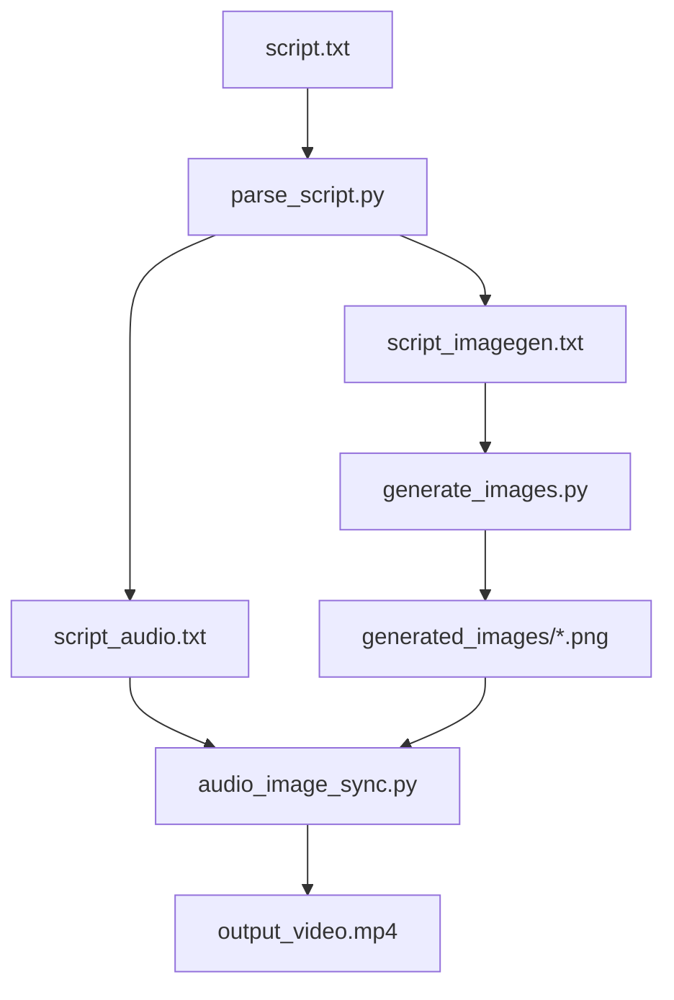

# SyncTube

Generate Video from a Scripted Storyline

## Overview

SyncTube is a toolkit for generating YouTube videos from scripts. It includes:
- Script parsing and processing
- Image generation from visual descriptions
- Audio-image synchronization
- Final video compilation

## Requirements

- Python 3.9+
- [ffmpeg](https://ffmpeg.org/) (must be installed and available in your system PATH)
- A Reve AI API key for image generation

## Installation

### Option 1: Using pip

1. Clone and setup environment:
```bash
git clone <repository_url>
cd SyncTube
python -m venv .venv
source .venv/bin/activate  # On Windows: .venv\Scripts\activate
pip install -r requirements.txt
```

### Option 2: Using uv (Faster Installation)

1. Clone and setup environment:
```bash
git clone <repository_url>
cd SyncTube
python -m venv .venv
source .venv/bin/activate

# Install uv
pip install uv

# Install dependencies using uv
uv pip install -r requirements.txt
```

2. Create a `.env` file with your Reve AI API key:
```bash
echo "REVE_API_KEY=your_api_key_here" > .env
```

**Note**: `uv` is recommended for faster dependency resolution and installation.

## Usage

### 1. Parse Script

First, parse your screenplay into separate files for audio and visuals:

```bash
python parse_script.py
```

This will:
- Read the input script specified in `config.yaml`
- Generate `script_audio.txt` and `script_imagegen.txt` in the same directory
- Extract visual descriptions and dialogue lines

### 2. Generate Images

Generate images from the visual descriptions:

```bash
python generate_images.py
```

This will:
- Read visual prompts from `script_imagegen.txt`
- Use Reve AI to generate images for each visual description
- Save images in a `generated_images` directory

### 3. Create Final Video

Sync the images with audio:

```bash
python audio_image_sync.py <folder> [--image_pattern PATTERNS] [--output_folder OUTPUT]
```

## Configuration

Create a `config.yaml` file:
```yaml
input_script: ~/path/to/your/script.txt
```

## File Structure

```
your_project/
  ├── script.txt              # Original screenplay
  ├── script_audio.txt        # Extracted dialogue/narration
  ├── script_imagegen.txt     # Extracted visual descriptions
  ├── generated_images/       # AI-generated images
  │   ├── 001.png
  │   ├── 002.png
  │   └── ...
  └── output_video.mp4       # Final compiled video
```

## Workflow



## License

MIT License. See [LICENSE](LICENSE).

## References

- [StudioBinder - Animation Scripts](https://www.studiobinder.com/blog/animation-scripts/)
- [Reve AI Documentation](https://reveai.com/docs)